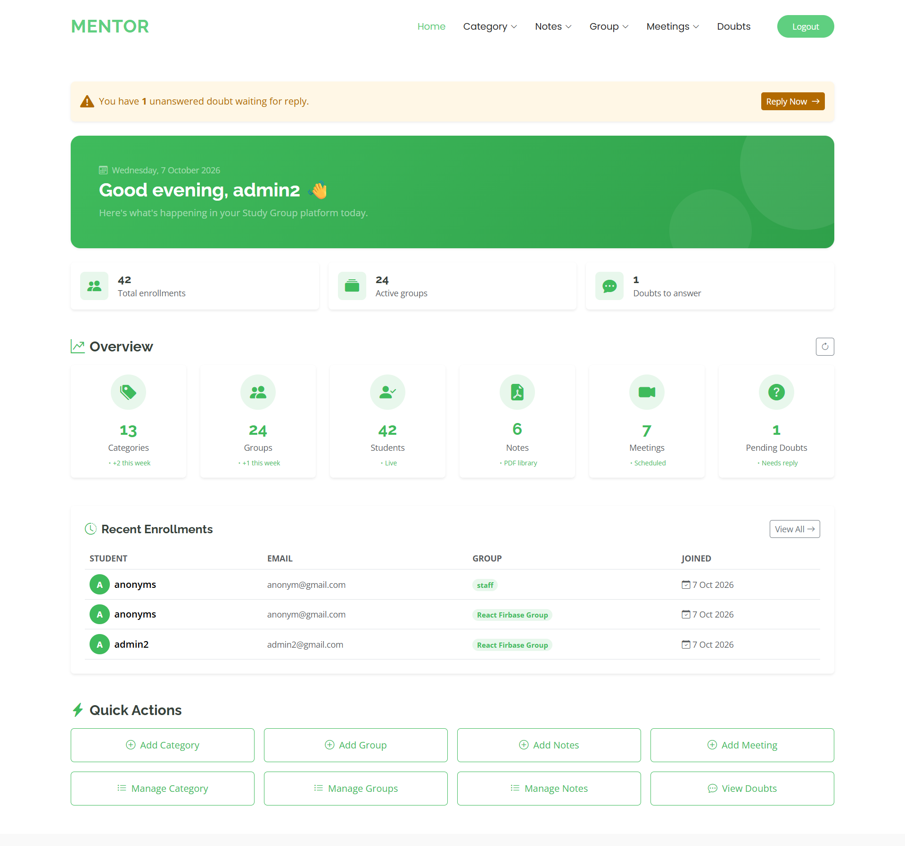
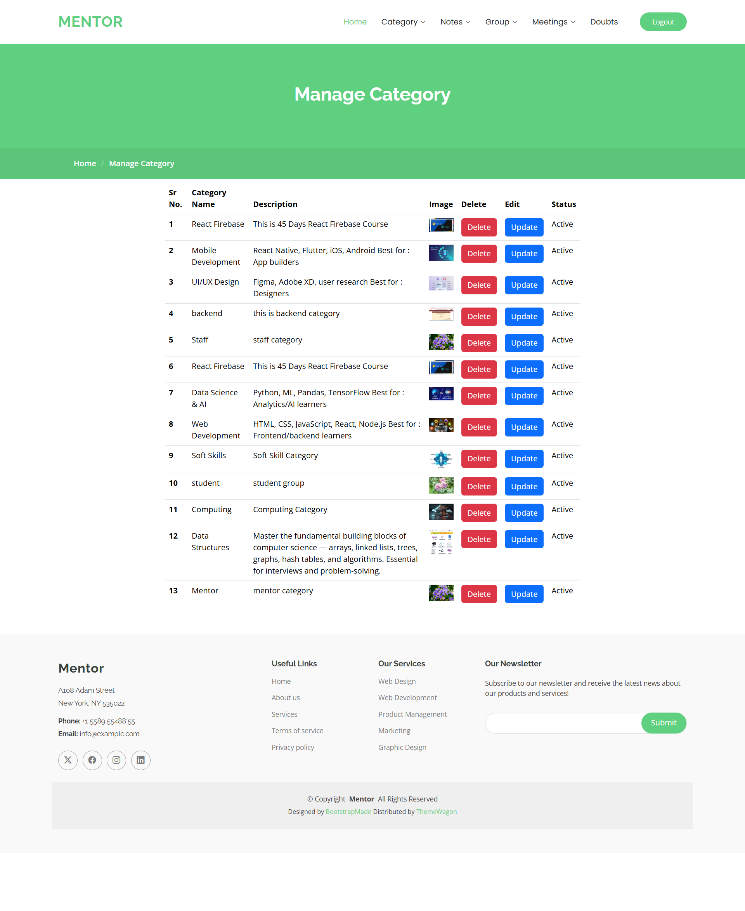
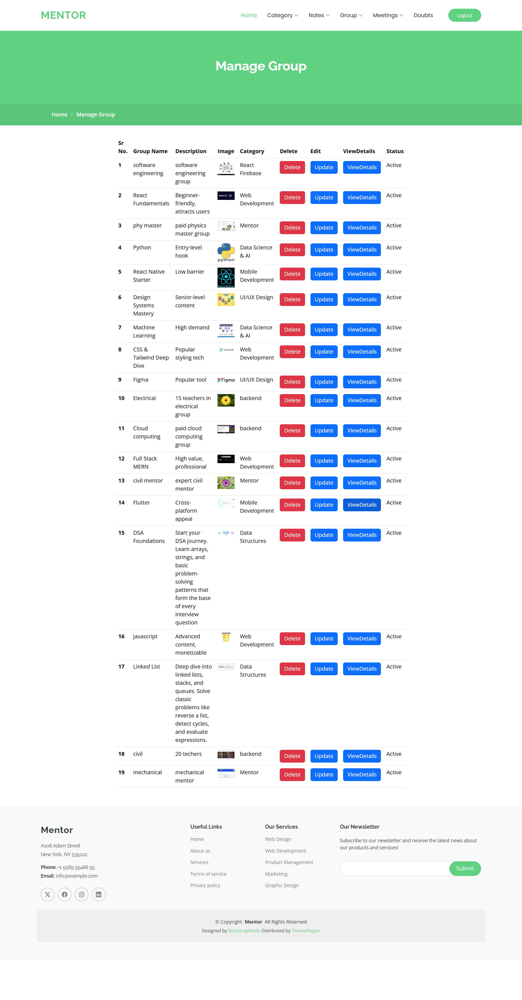
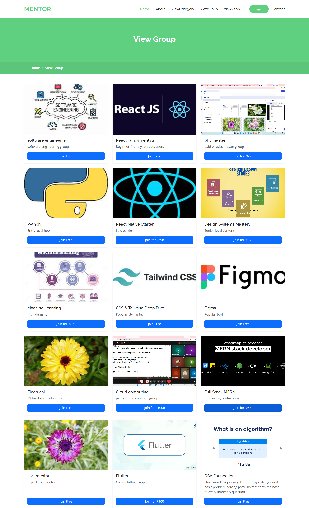
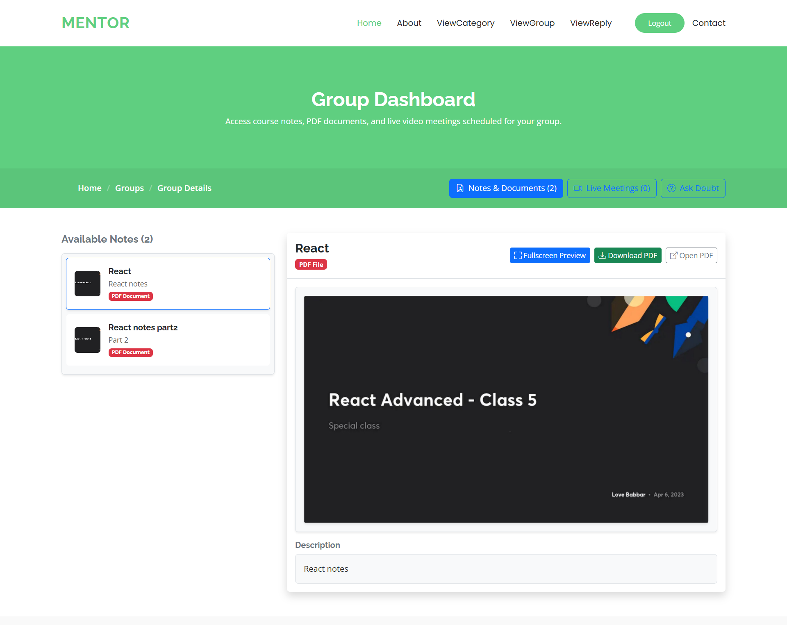
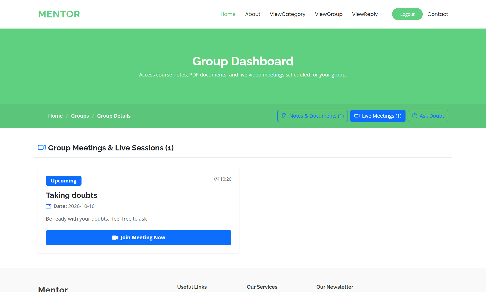
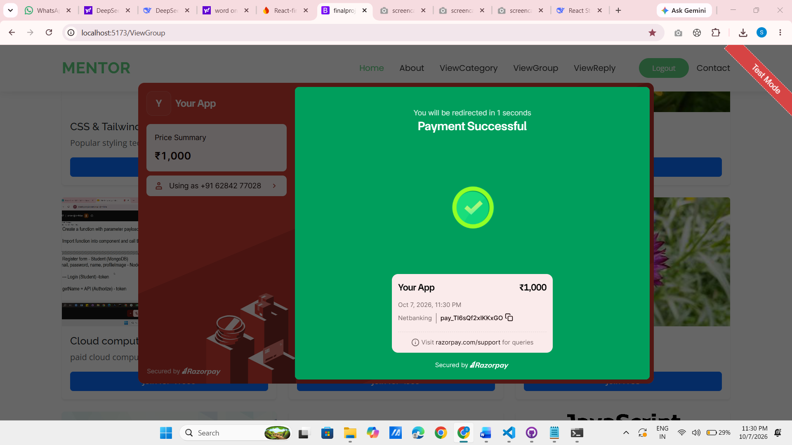

# 📚 Study Group Platform

A full-stack **React-based Study Group Platform** for managing study groups, courses, study materials, live meetings, student enrollments, and doubts.

The platform provides two separate experiences:

* 👨‍💼 **Admin Panel** — manage categories, groups, notes, meetings, students, and doubts.
* 🎓 **Student Portal** — browse groups, enroll in free or paid groups, access study materials, attend meetings, and ask doubts.

---

## ✨ Features

### 👨‍💼 Admin Panel

* 📊 **Dashboard** — View live statistics, recent enrollments, pending doubts, and quick actions.
* 📚 **Categories** — Create, update, delete, and manage course categories with images.
* 👥 **Study Groups** — Create and manage free or paid study groups with cover images.
* 📄 **Notes** — Upload and manage PDF study materials for each group.
* 🗓️ **Meetings** — Schedule live sessions and share meeting links.
* 💬 **Doubts** — View student questions and send replies.
* 🎓 **Enrolled Students** — View students enrolled in each group along with their contact information.
* 🔐 **Role-Based Access** — Protected admin routes with admin/student authorization.

### 🎓 Student Portal

* 🔎 Browse available course categories and study groups.
* 👥 View detailed information about study groups.
* 🆓 Join free study groups.
* 💳 Join paid study groups using **Razorpay**.
* 📄 Access, preview, and download PDF study materials.
* 🎥 Join live meetings through shared meeting links.
* ❓ Ask doubts and view replies from administrators.
* 👤 Manage authentication through Firebase Authentication.

---

## 🔒 Security

The application includes several security measures:

* Firebase Authentication for user authentication.
* Admin/student role-based access.
* Protected admin routes using `ProtectedRoutes.jsx`.
* Firestore security rules.
* Environment variables for Firebase configuration.
* No sensitive credentials committed to Git.
* Domain restrictions for API keys where applicable.
* Authentication-required operations for private user data.

> **Important:** Firebase API keys are designed to be used in client applications, but Firestore rules and other backend security controls must be configured correctly. Never commit private API secrets or service-account credentials to the repository.

---

## 🛠️ Tech Stack

| Layer          | Technology              |
| -------------- | ----------------------- |
| Frontend       | React 19                |
| Build Tool     | Vite 8                  |
| Routing        | React Router 7          |
| Backend        | Firebase                |
| Authentication | Firebase Authentication |
| Database       | Cloud Firestore         |
| Media Storage  | Cloudinary              |
| Payments       | Razorpay                |
| UI Framework   | Bootstrap 5             |
| Icons          | Bootstrap Icons         |
| Notifications  | React Toastify          |
| Modals         | SweetAlert2             |
| HTTP Client    | Axios                   |

---


## 📸 Screenshots

### Admin Dashboard


### Category Management


### Group Management


### Student Group View


### Notes Preview


### Meetings


### Ask Doubts


### Doubts reply


### Payment


---

# 🚀 Getting Started

## Prerequisites

Before running the project, make sure you have:

* **Node.js 18+**
* **npm**
* A **Firebase project**
* A **Cloudinary account**
* A **Razorpay account** for payment integration

Firebase, Cloudinary, and Razorpay can be configured using their respective free/test tiers during development.

---

## 📥 Installation

### 1. Clone the repository

```bash
git clone https://github.com/ShivaniKumari5/react-project.git
```

Navigate into the project:

```bash
cd react-project
```

### 2. Install dependencies

```bash
npm install
```

### 3. Configure environment variables

Create a `.env` file in the project root.

You can use `.env.example` as a template:

```env
VITE_FIREBASE_API_KEY=your_api_key
VITE_FIREBASE_AUTH_DOMAIN=your_project.firebaseapp.com
VITE_FIREBASE_PROJECT_ID=your_project_id
VITE_FIREBASE_STORAGE_BUCKET=your_project.firebasestorage.app
VITE_FIREBASE_MESSAGING_SENDER_ID=your_sender_id
VITE_FIREBASE_APP_ID=your_app_id
VITE_FIREBASE_MEASUREMENT_ID=your_measurement_id
```

> Do not commit your `.env` file to Git.

---

# 🔥 Firebase Configuration

## 1. Create a Firebase project

Go to:

https://console.firebase.google.com/

Create a new Firebase project.

## 2. Enable Authentication

Navigate to:

**Firebase Console → Authentication → Sign-in method**

Enable:

* Email/Password

## 3. Create Firestore Database

Navigate to:

**Firebase Console → Firestore Database**

Create a database and configure the security rules according to your application's requirements.

## 4. Add Firebase configuration

Copy your Firebase web application configuration values into the `.env` file.

---

# 🔐 Firestore Security Rules

The project uses Firestore collections for categories, groups, notes, meetings, memberships, doubts, and users.

A development-oriented rules configuration is shown below:

```firestore
rules_version = '2';

service cloud.firestore {

  match /databases/{database}/documents {

    match /category/{doc} {
      allow read: if true;
      allow write: if request.auth != null;
    }

    match /group/{doc} {
      allow read: if true;
      allow write: if request.auth != null;
    }

    match /notes/{doc} {
      allow read: if true;
      allow write: if request.auth != null;
    }

    match /meeting/{doc} {
      allow read: if true;
      allow write: if request.auth != null;
    }

    match /groupMember/{doc} {
      allow read, create, update, delete: if request.auth != null;
    }

    match /doubt/{doc} {
      allow read, create, update: if request.auth != null;
    }

    match /users/{uid} {
      allow read: if request.auth != null;
      allow write: if request.auth != null
        && request.auth.uid == uid;
    }

    match /{document=**} {
      allow read, write: if false;
    }
  }
}
```

> **Production note:** These rules should be reviewed and strengthened before deploying the application publicly. In particular, authenticated users should not automatically be allowed to modify every document in admin-managed collections.

---

# ☁️ Cloudinary Configuration

Cloudinary is used for uploading and serving:

* 🖼️ Category images
* 🖼️ Group cover images
* 📄 PDF study materials

Create a Cloudinary account:

https://cloudinary.com/

Configure the required Cloudinary upload settings according to your application.

---

# 💳 Razorpay Configuration

Razorpay is used for paid study group enrollment.

Create a Razorpay account:

https://razorpay.com/

For development, use **Razorpay Test Mode**.

> Never expose private Razorpay keys or other server-side credentials in frontend code.

---

# ▶️ Run the Application

Start the development server:

```bash
npm run dev
```

The application will normally be available at:

```text
http://localhost:5173
```

---

# 📁 Project Structure

```text
src/
│
├── components/
│   │
│   ├── admin/
│   │   ├── Dashboard.jsx
│   │   │
│   │   ├── category/
│   │   │   ├── AddCategory.jsx
│   │   │   ├── ManageCategory.jsx
│   │   │   └── UpdateCategory.jsx
│   │   │
│   │   ├── group/
│   │   │   ├── AddGroup.jsx
│   │   │   ├── ManageGroup.jsx
│   │   │   ├── UpdateGroup.jsx
│   │   │   └── ViewGroup.jsx
│   │   │
│   │   ├── notes/
│   │   │   ├── AddNotes.jsx
│   │   │   ├── ManageNotes.jsx
│   │   │   └── UpdateNotes.jsx
│   │   │
│   │   ├── groupmeeting/
│   │   │   ├── AddMeeting.jsx
│   │   │   └── ManageMeeting.jsx
│   │   │
│   │   └── doubt/
│   │       └── ManageDoubt.jsx
│   │
│   ├── user/
│   │   ├── Home.jsx
│   │   ├── About.jsx
│   │   ├── Contact.jsx
│   │   ├── Login.jsx
│   │   ├── Register.jsx
│   │   ├── ViewCategory.jsx
│   │   ├── ViewGroup.jsx
│   │   ├── ViewSingleGroup.jsx
│   │   ├── Open.jsx
│   │   ├── ViewReply.jsx
│   │   └── NotFound.jsx
│   │
│   └── ProtectedRoutes.jsx
│
├── layout/
│   ├── admin/
│   │   ├── Header
│   │   └── Footer
│   │
│   └── user/
│       ├── Header
│       └── Footer
│
├── services/
│   └── API and Firebase service wrappers
│
├── model/
│   └── Data model classes
│
├── Firebase.js
├── App.jsx
└── main.jsx
```

---

# 🔐 Environment Variables

The following environment variables are required:

| Variable                            | Description                     |
| ----------------------------------- | ------------------------------- |
| `VITE_FIREBASE_API_KEY`             | Firebase API key                |
| `VITE_FIREBASE_AUTH_DOMAIN`         | Firebase Authentication domain  |
| `VITE_FIREBASE_PROJECT_ID`          | Firebase project ID             |
| `VITE_FIREBASE_STORAGE_BUCKET`      | Firebase Storage bucket         |
| `VITE_FIREBASE_MESSAGING_SENDER_ID` | Firebase messaging sender ID    |
| `VITE_FIREBASE_APP_ID`              | Firebase application ID         |
| `VITE_FIREBASE_MEASUREMENT_ID`      | Google Analytics measurement ID |

Example `.env`:

```env
VITE_FIREBASE_API_KEY=your_api_key
VITE_FIREBASE_AUTH_DOMAIN=your_project.firebaseapp.com
VITE_FIREBASE_PROJECT_ID=your_project_id
VITE_FIREBASE_STORAGE_BUCKET=your_project.firebasestorage.app
VITE_FIREBASE_MESSAGING_SENDER_ID=your_sender_id
VITE_FIREBASE_APP_ID=your_app_id
VITE_FIREBASE_MEASUREMENT_ID=your_measurement_id
```

Make sure `.env` is included in `.gitignore`:

```gitignore
.env
.env.local
.env.*.local
```

---

# 🗄️ Firestore Collections

| Collection    | Purpose                                              |
| ------------- | ---------------------------------------------------- |
| `category`    | Stores course categories                             |
| `group`       | Stores study groups, including free/paid information |
| `groupMember` | Stores student-to-group enrollment records           |
| `notes`       | Stores study material metadata and PDF information   |
| `meeting`     | Stores scheduled live meetings                       |
| `doubt`       | Stores student questions and admin replies           |
| `users`       | Stores user profiles and account information         |

---

# 🔄 Application Flow

### 👨‍💼 Admin Flow

```text
Admin Login
     ↓
Admin Dashboard
     ↓
Manage Categories
     ↓
Create Study Groups
     ↓
Upload Notes
     ↓
Schedule Meetings
     ↓
Manage Enrolled Students
     ↓
Answer Student Doubts
```

### 🎓 Student Flow

```text
Student Registration/Login
          ↓
Browse Categories
          ↓
Browse Study Groups
          ↓
View Group Details
          ↓
 ┌────────┴────────┐
 ↓                 ↓
Free Group       Paid Group
 ↓                 ↓
Join Group      Razorpay Payment
 └────────┬────────┘
          ↓
   Group Dashboard
          ↓
 ┌────────┼─────────┐
 ↓        ↓         ↓
Notes   Meetings   Doubts
```

---

# 🎯 Roadmap

## ✅ Completed

* [x] Admin dashboard with live statistics
* [x] Category CRUD operations
* [x] Study group CRUD operations
* [x] Notes/study material management
* [x] Meeting management
* [x] Doubt and reply system
* [x] Student enrollment flow
* [x] Free group enrollment
* [x] Paid group enrollment
* [x] Razorpay payment integration
* [x] Protected admin routes
* [x] Role-based access
* [x] Firestore security rules
* [x] Environment variable configuration
* [x] 404 fallback page
* [x] View enrolled students per group

## 🚧 Planned

* [ ] Search and filtering on admin pages
* [ ] Export enrolled students to CSV
* [ ] Email notifications for doubt replies
* [ ] Password reset flow
* [ ] Student profile editing
* [ ] Analytics dashboard
* [ ] Dark mode
* [ ] Improved production-level Firestore authorization

---

# 🤝 Contributing

This is primarily a personal learning project, but suggestions and improvements are welcome.

If you would like to contribute:

1. Fork the repository.
2. Create a new branch.

```bash
git checkout -b feature/your-feature
```

3. Make your changes.
4. Commit your changes.

```bash
git add .
git commit -m "Add your feature"
```

5. Push your branch.

```bash
git push origin feature/your-feature
```

6. Open a Pull Request.

---

# 📜 License

This project is intended primarily for **learning and educational purposes**.

You are welcome to study and reference the code. Please make significant modifications and review all third-party licenses before using the project as a commercial product.

---

# 👤 Author

**Shivani Kumari**

* GitHub: [@ShivaniKumari5](https://github.com/ShivaniKumari5)
* Repository: [react-project](https://github.com/ShivaniKumari5/react-project)

---

# 🙏 Acknowledgements

Special thanks to the projects and services used to build this application:

* [React](https://react.dev/)
* [Vite](https://vite.dev/)
* [Firebase](https://firebase.google.com/)
* [Cloudinary](https://cloudinary.com/)
* [Razorpay](https://razorpay.com/)
* [Bootstrap](https://getbootstrap.com/)
* [Bootstrap Icons](https://icons.getbootstrap.com/)
* [React Router](https://reactrouter.com/)
* [Axios](https://axios-http.com/)
* [React Toastify](https://fkhadra.github.io/react-toastify/)
* [SweetAlert2](https://sweetalert2.github.io/)
* [BootstrapMade](https://bootstrapmade.com/)

---

## ⭐ Support

If you found this project useful or interesting, consider giving the repository a ⭐ on GitHub!

**Made with ❤️ by Shivani Kumari**
